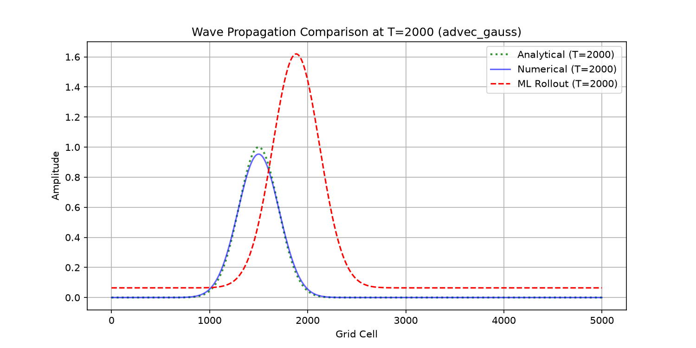
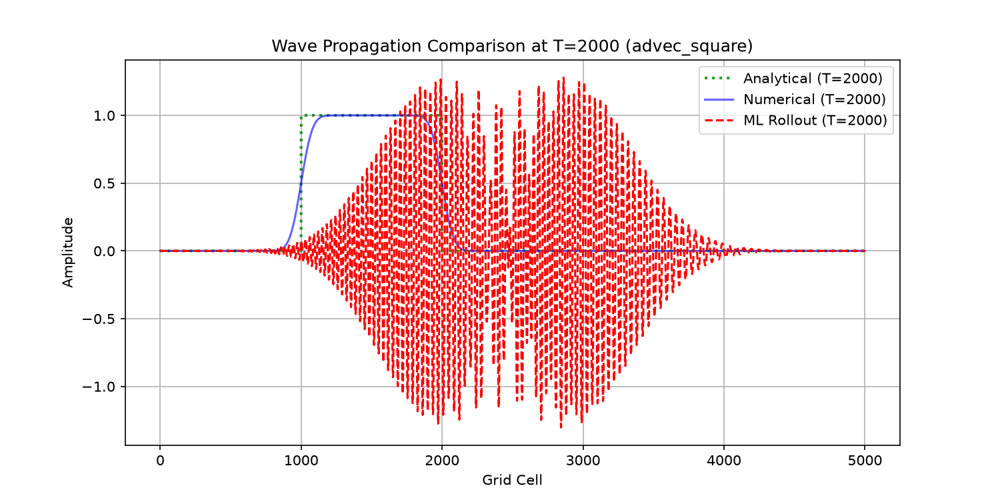
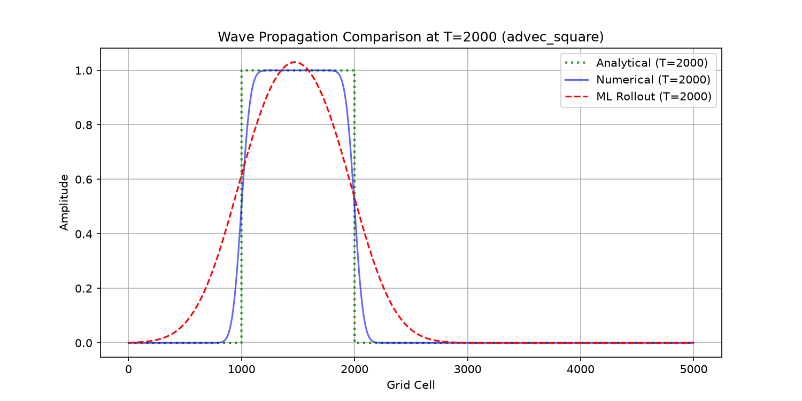
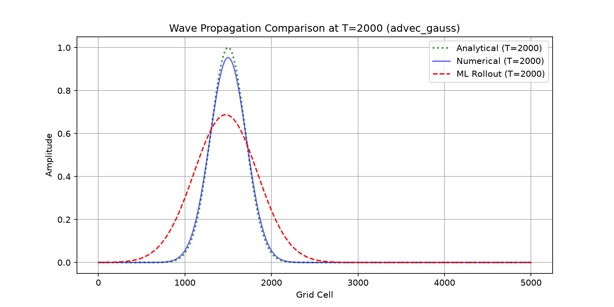
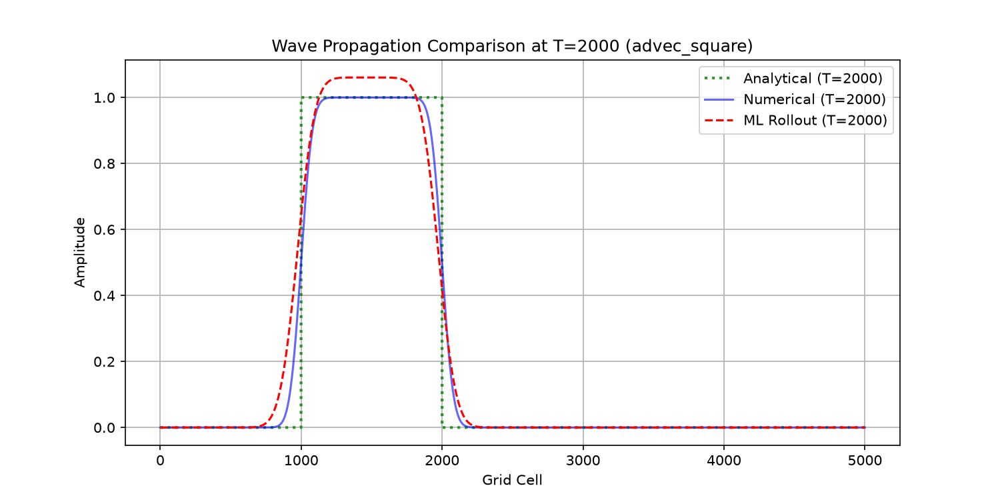
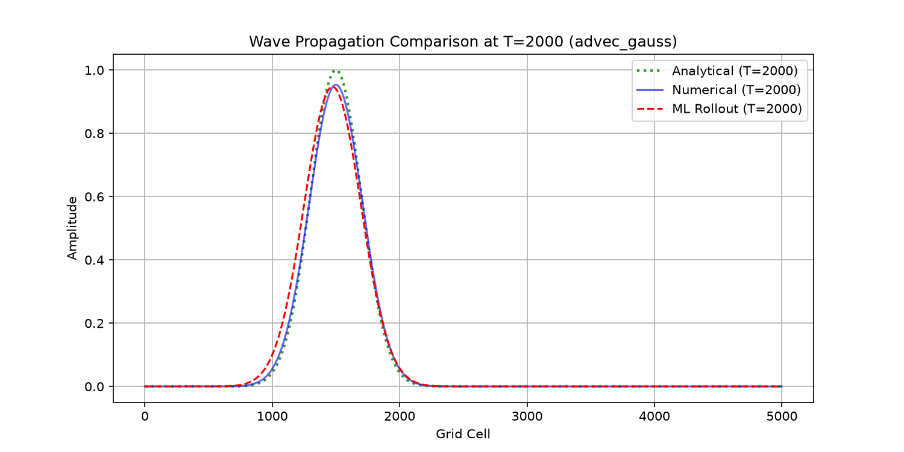
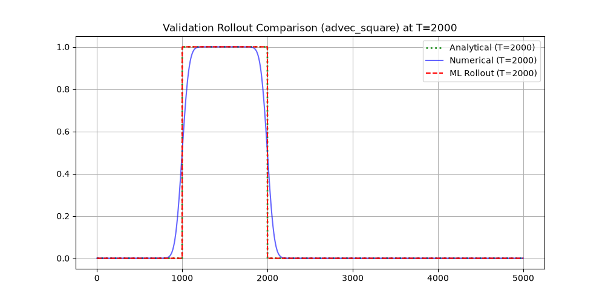
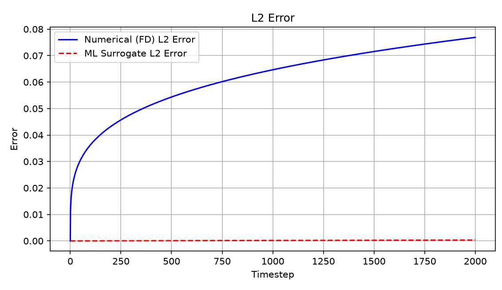

# Evolution of the Advection Surrogate
Building on the previous document [surrogate_setup.md](https://github.com/h-livv/tempest/blob/main/docs/surrogate_setup.md) (highly recommended read), this document provides a breakdown of how the ML pipeline was optimized to achieve a highly stable, generalized, physics-informed surrogate model.

---

Key findings:
- Stable long-horizon autoregressive rollout is achievable with lightweight CNN surrogates.
- Translation-consistent transport dynamics emerged through local convolutional learning.
- The surrogate generalized to unseen initial conditions.
- Learned operators exhibited numerical artifacts analogous to classical finite-difference schemes.

---

## Summary
The previous document produced a physics-informed model that worked decently well for a limited set of parameters. Even though it successfully generalized over two models, it failed to display stability over long periods of time and was not tested on unseen initial conditions.

To track stability, error comparison against the analytical solution was plotted for the numerical and surrogate solution. In addition to this, the initial condition of the dirac-delta function (a sharp peak) was also introduced for training.

Particular emphasis was placed on long-horizon autoregressive stability, where the surrogate repeatedly consumes its own predictions during rollout.

## Baseline:
The model was trained on 2000 steps of numerical solution and asked to predict the next 2000 steps. The model perfomed poorly, inflated artificial amplitude and in the case of the sharp peak, completely broke down. 

  

- Possible issue: The kernel size was small. It must not have had enough grid context for accurate prediction, compensating through artificial amplification.

## Iteration 1:
The kernel size was expanded from 9 to 25.
- However, the wave's shape broke down and exploded into Gibb's oscillations.

  

- Possible issue: The CNN was unconstrained. The initial random weights had no limit and were random. This may have been artificially magnifying the energy of the system. This, coupled with a high kernel size may have caused Gibb's phenomenon.

## Iteration 2:
The kernel weights were initialized in a way that all were strictly positive and add to one (a Markov Stochastic Matrix).
- This solved the energy explosion, but now the wave predictions still didn't hold shape over a long time period. 

  

- Possible issue: The system was overpowered by the "Data" Loss, which found it easier to smear out the wave than hold its shape. But at the same time, the physics loss was forcing shape consistency.

## Iteration 3:
The physics loss function was dropped entirely, focusing on the Softmax Markov model. This constrained the weights to remain positive and normalized, stabilizing rollout behavior and preventing artificial amplification.
-  The shape retention was much better, but still devolved over a long period of time.

  

- Possible issue: The softmax function is inherently "soft". Since its sum cannot exceed one, it averages out the weights into a flat distribution, mixing data from neighboring cells and acting like a blurring function.

## Iteration 4:
The kernel weights were multiplied by 1000 before applying the softmax, which forced a hardmax/dirac-delta kernel distribution. This significantly reduced numerical blurring by ensuring the network deterministically copies the exact state of the previous cell.
- For relatively short periods of time (T < 2000s), the wave closely matched the analytical solution. The error plots agreed with this observation.

  

## Iteration 5:
To test the true capabilities of this model, it was used to predict 10000 simulation steps on just 2500 steps of numerical training. Furthermore, it was also asked to predict a completely unseen intial condition of a gaussian wave shifted from its center.
- Shape was perfectly conserved with zero energy loss, even on the unseen initial condition. However, a severe phase lag was observed in all cases. The predicted wave was travelling much slower than expected.

  

- This observation called for analysis on the velocity. The wave peak was plotted against physical time, and the following was obtained:

| Test Case             | Analytical Speed (c) | Numerical Velocity | Numerical Error (%) | ML Surrogate Velocity | ML Surrogate Error (%) |
|----------------------|----------------------|---------------------|---------------------|-----------------------|------------------------|
| advec_square         | 1.0                  | 1.014327            | 1.4327              | 0.499009              | 50.0991                |
| advec_peak           | 1.0                  | 1.000000            | 0.0000              | 0.500000              | 50.0000                |
| advec_gauss          | 1.0                  | 1.000000            | 0.0000              | 0.499926              | 50.0074                |
| advec_shifted_gauss  | 1.0                  | 1.000000            | 0.0000              | 0.499898              | 50.0102                |

- The surrogate velocity consistently converged to half that of the numerical and analytical velocity. This implied the model was learning an equation that had half the analytical velocity.
- Possible issues:
    * Premature softmax saturation - The weights get "frozen" early on due to the high multiplier and are unable to read the loss landscape.
    * Scheme violation - For a wave moving towards the right, the upwind scheme only looks at information coming from the left. Random initialization forces the model to learn upwind behaviour entirely from optimization.
    * Unroll horizon - Currently only set to two. 

## Iteration 6:
1. Instead of flash-freezing the model's weights immediately, we start with a soft multiplier of 1.0, and slowly turn up the "temperature" to 1000 over hundreds of epochs.
2. We initialize weights with a bias towards the left, which gives the model a hint as to how the upwind scheme works.
3. We increase unroll steps to 8, enabling the model to predict the wave eight steps into the future during training, instead of just two.

- The surrogate model closely matched the analytical solution and combatted the diffusive effects of the upwind scheme, even though it was trained purely on numerically generated data.
- Furthermore, accurate rollout on shifted gaussian profiles demonstrates that the surrogate learned the underlying transport behaviour rather than memorizing fixed patterns.

  

| Parameter         | Value |
|------------------|-------|
| Learning Rate    | 0.005 |
| Epochs           | 1000  |
| Batch Size       | 64    |
| Unroll Steps     | 8     |
| Train Timesteps  | 2500  |
| Test Timesteps   | 10000 |    

## Time speedup
A script was written to calculate the time speedup of training and testing the model as compared to Tempest's numerical solver, and the following was observed:

Numerical Solver: 461.35 seconds  
ML Training (1000 epochs): 32.42 seconds 
After training, surrogate inference generated long rollouts nearly instantaneously. 

## Learned Numerical Behaviour

The surrogate did not merely interpolate training data. Instead, it behaved similarly to a numerical transport scheme.

Observed characteristics included:
- numerical diffusion
- phase lag (numerical dispersion)
- stability constraints
- directional transport dependence
- long-horizon accumulation error

This suggests the network learned an approximate transport operator rather than memorizing fixed trajectories.

## Conclusion

This continuous optimization process produced a highly stable, generalized PDE surrogate for the linear advection equation that is considerably faster than a finite-difference numerical solver.  
The surrogate ultimately behaved as a learned numerical transport operator, exhibiting stability, conservation, and dispersion characteristics analogous to classical finite-difference schemes.  
More importantly, it serves as a baseline from which surrogates of more complex, shock-based PDEs such as the shallow water equations can be developed.

## Future Work

- This study truly approaches the limit of purely local CNN modelling.
- The following investigation is planned:
    * Multi-resolution training
    * CFL generalization
    * Comparison against numerical schemes
- To reduce phase lag, the model naturally leads to:
    * Fourier methods
    * Neural operators
    * Frequency-domain learning

---
