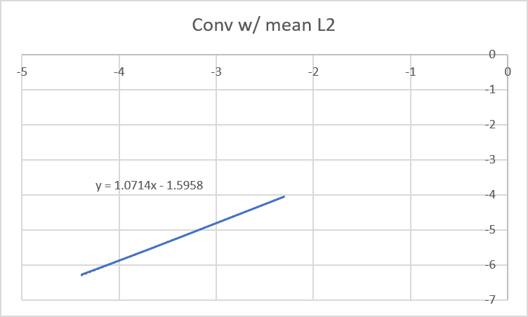
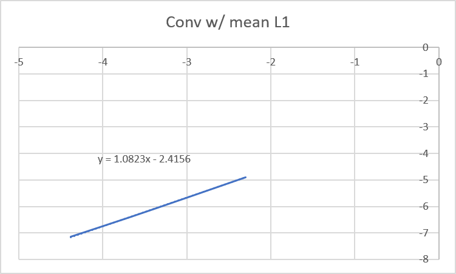

# Advection Convergence Study

## Overview

This study investigates the convergence behaviour of the numerical advection solver implemented in Tempest.

The objective is to verify that the numerical solution approaches the analytical solution under mesh refinement and to experimentally recover the theoretical order of convergence of the numerical scheme.

The study was performed using automated parameter sweeps and analytical validation against the exact periodic solution of the linear advection equation.

---

# Governing Equation

The linear advection equation is:

```text
∂u/∂t + c ∂u/∂x = 0
```

where:

* `u(x,t)` is the transported scalar field
* `c` is the constant advection velocity

The equation describes pure transport of a waveform without distortion.

---

# Analytical Solution

For an initial condition:

```text
u(x,0) = f(x)
```

the analytical solution is:

```text
u(x,t) = f(x - ct)
```

Under periodic boundaries, coordinates exiting one side of the domain are wrapped back into the domain. Essential for accurate results.

---

# Numerical Configuration

## Spatial Discretization

* Upwind finite-difference scheme

## Time Integration

* RK4 integrator

## Boundary Condition

* Periodic

## Initial Condition

Gaussian pulse:

```text
u(x,0) = exp(-(x - xc)^2 / (2σ^2))
```

---

# Convergence Methodology

The same physical problem was solved under progressively refined spatial grids.

The following quantities were held constant:

* physical domain length
* CFL ratio
* physical final time
* initial condition

Only:

* grid resolution (`N`)
* grid spacing (`dx`)
* timestep (`dt`)

were refined.

The timestep was scaled proportionally with spatial resolution:

```text
dt ∝ dx
```

to maintain a constant CFL condition.

---

# Grid Configurations

| N     | dx     | dt      |
| ----- | ------ | ------- |
| 2500  | 0.1    | 0.01    |
| 5000  | 0.05   | 0.005   |
| 10000 | 0.025  | 0.0025  |
| 20000 | 0.0125 | 0.00125 |

The CFL ratio remained fixed throughout the study:

```text
dt / dx = 0.1
```

---

# Error Metrics

The numerical solution was compared against the analytical solution using:

## L1 Error

```text
L1 = (1/N) Σ |u_num - u_exact|
```

## L2 Error

```text
L2 = sqrt((1/N) Σ (u_num - u_exact)^2)
```

Time-averaged error metrics were used throughout the simulation.

---

# Convergence Analysis

To estimate convergence order, the following relationship was used:

```text
E ~ dx^p
```

Taking logarithms:

```text
log(E) = p log(dx) + C
```

where:

* `E` is the numerical error
* `p` is the observed convergence order

Linear regression was performed on:

```text
log(error) vs log(dx)
```

The slope of the fitted line gives the empirical convergence order.

---

# Results

## Mean L2 Error

| dx     | Mean L2 Error |
| ------ | ------------- |
| 0.1    | 17.3e-3       |
| 0.05   | 8.15e-3       |
| 0.025  | 3.85e-3       |
| 0.0125 | 1.86e-3       |



Observed convergence slope:

```text
p ≈ 1.07
```

---

## Mean L1 Error

| dx     | Mean L1 Error |
| ------ | ------------- |
| 0.1    | 7.45e-3       |
| 0.05   | 3.46e-3       |
| 0.025  | 1.62e-3       |
| 0.0125 | 0.7e-3        | 



Observed convergence slope:

```text
p ≈ 1.08
```

---

# Interpretation

The measured convergence order approaches:

```text
p ≈ 1
```

which matches the theoretical first-order accuracy of the upwind finite-difference scheme.

The study confirms that:

* analytical validation is functioning properly
* the numerical solution converges under mesh refinement

---

# Numerical Observations

## Numerical Diffusion

The upwind scheme introduces artificial numerical diffusion.

Observed effects:

* gradual amplitude decay
* energy dissipation over time

However, the scheme remained:

* stable
* monotonic
* free from oscillatory artefacts

---

# Key Conclusions

1. Tempest successfully reproduces first-order convergence behaviour for linear advection.
2. The automated validation and convergence pipeline functions correctly.
3. Mesh refinement consistently reduces numerical error.

---
