# Burgers' Equation: Validation & Convergence Study

This document details the validation and convergence testing for the 1D non-linear Burgers' equation modeled in Tempest:
$\frac{\partial u}{\partial t} + u \frac{\partial u}{\partial x} = \nu \frac{\partial^2 u}{\partial x^2}$

## 1. Validation Study & Boundary Interaction

### The Periodic Boundary Trap
Our initial validation sweeps for the **Traveling Shock** initial condition highlighted a critical physical discrepancy when using **Periodic** boundary conditions on a finite domain. 

- **The Setup**: A compression shock interpolates $u_L=2.0$ down to $u_R=1.0$ at the center of the domain.
- **The Issue**: Periodic boundaries force the right edge ($1.0$) to wrap around to the left edge ($2.0$). In Burgers' non-linear mechanics, a $1.0 \to 2.0$ jump acts as an expansion wave.
- **The Result**: The periodic expansion jump forms a **rarefaction fan** (a linear ramp $u=x/t$). Over time, this fan eventually interacts with and alters the isolated compression shock, so the numerical solution no longer represents the same physical problem as the analytical traveling-wave solution.

**The Periodic Failure Timeline (Rarefaction Fan)**

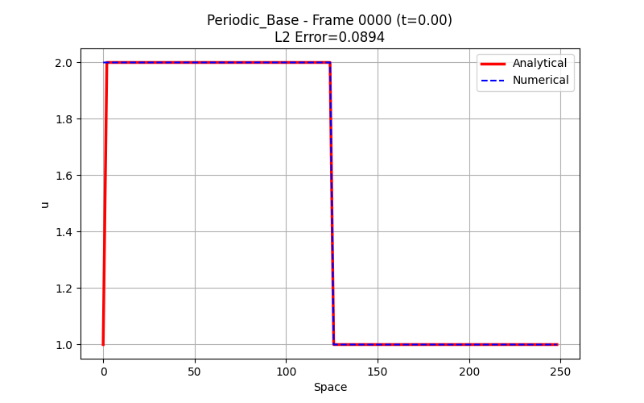 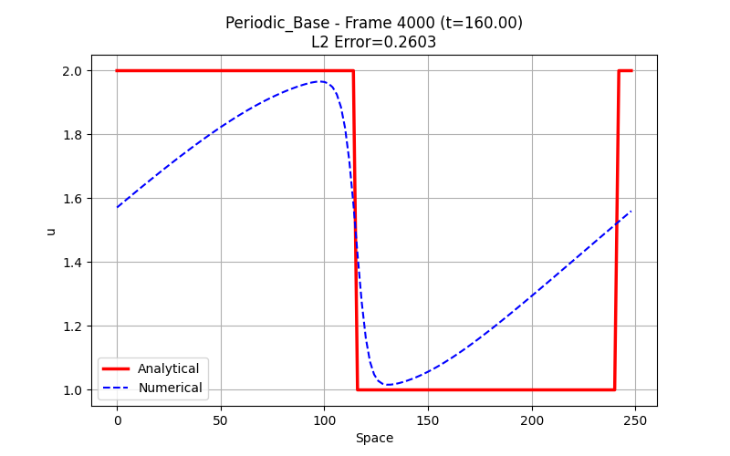  

### The Dirichlet Fix
To stabilize the traveling shock over long durations, we implemented **Dirichlet** boundaries (`boundaries.Dirichlet(2.0, 1.0)`). 
By strictly holding the boundaries at the values demanded by the infinite-domain analytical solution, we prevent the formation of the rarefaction fan. 

**The Dirichlet Success Timeline (Stable Shock)**

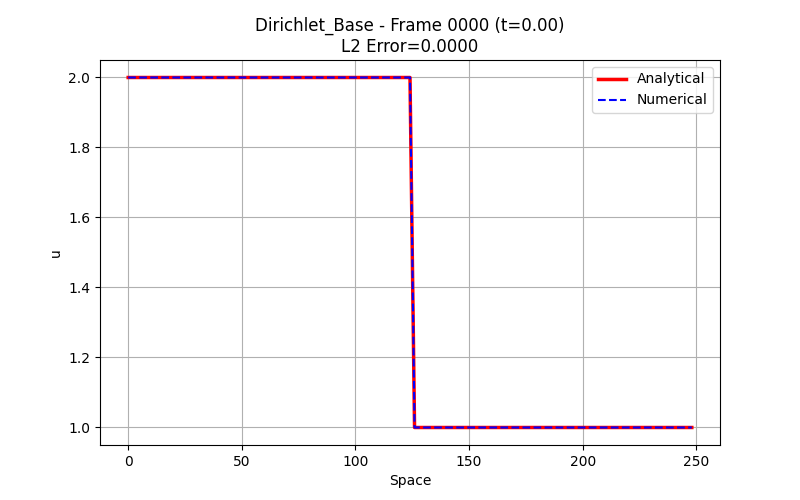 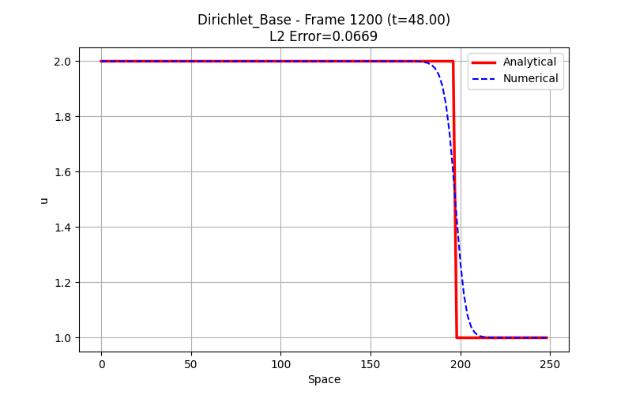 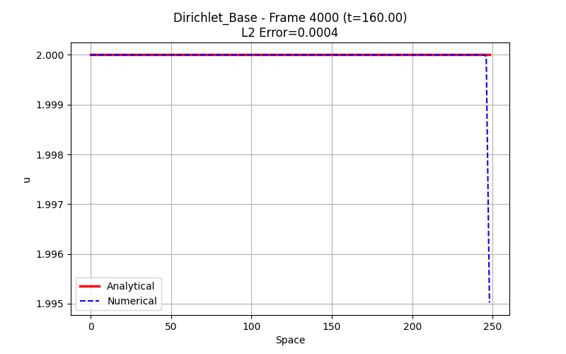

**Error Evolution Comparison**

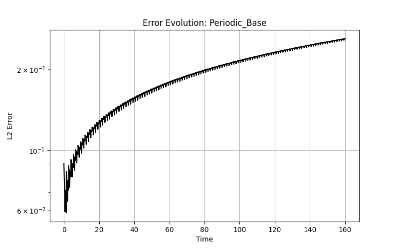 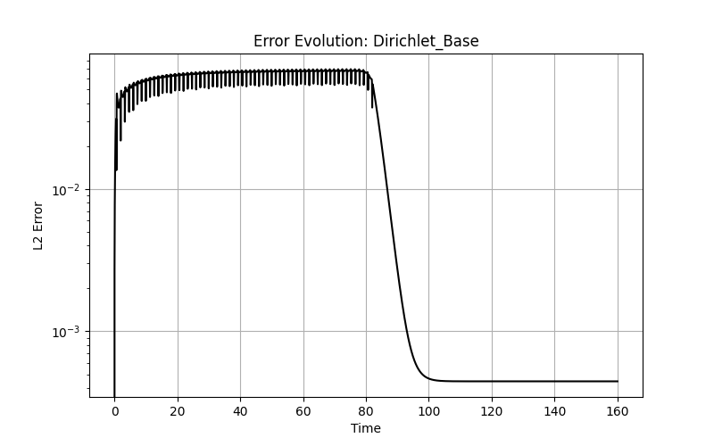

> The numerical solution remains in close agreement with the analytical traveling-shock solution throughout the validation interval.

---

## 2. Convergence Study

We conducted a grid convergence study across multiple direct and iterative solvers to assess their order of accuracy when resolving the discontinuous shock front.

**Grid Parameters**:
- $N = [250, 500, 1000, 2000]$
- $CFL (\Delta t / \Delta x) = 0.02$

**Evaluated Solvers**:
1. **Lax-Friedrichs** 
2. **RK4 + Upwind** 
3. **Lax-Wendroff** 

### Results Analysis

| Solver | Observed Order ($O(\Delta x)$) in $L_2$ | Theoretical Max for Discontinuities |
| :--- | :--- | :--- |
| **Lax-Friedrichs** | $0.26$ | $0.5$ |
| **RK4 + Upwind** | $0.40$ | $0.5$ |
| **Lax-Wendroff** | $0.68$ | $0.5$ |

**Convergence Plots (Shock)**

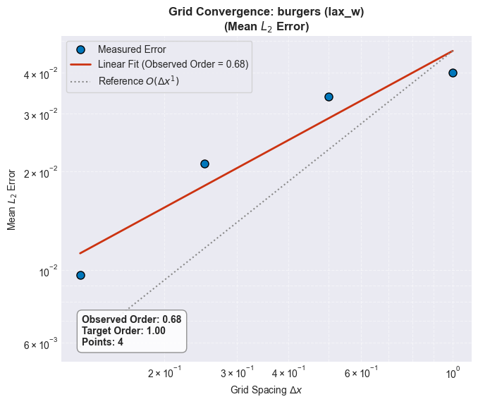 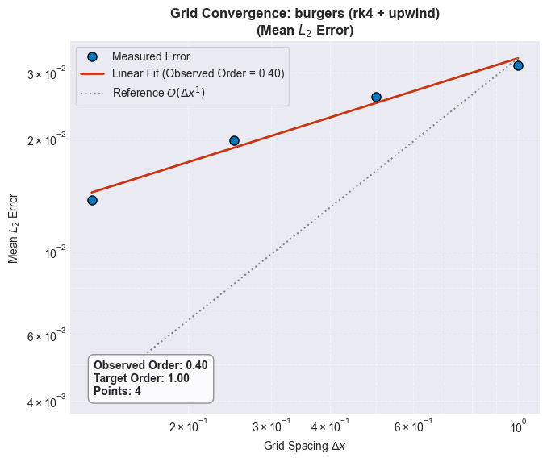 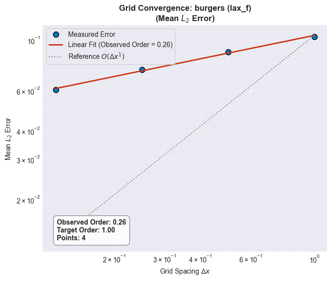

> **Why are the convergence orders fractional?** 
> The theoretical convergence rate of numerical methods across a discontinuous shock profile in the $L_2$ norm drops significantly. Even in a theoretical 2nd-order scheme, the shock dominates the error, reducing the measured convergence rate well below the smooth-solution truncation order. Consequently, fractional convergence orders are expected for shock-dominated problems.

### Conclusions (Shock)

1. **The PDE Converges**: All three solvers demonstrate positive convergence slopes (the error strictly decreases as the grid is refined).
2. **Lax-Wendroff is Superior**: Due to its 2nd-order predictor-corrector nature, Lax-Wendroff achieves the highest convergence rate ($O(\Delta x^{0.68})$), visibly resolving the shock front with less artificial diffusion than Lax-Friedrichs.
3. **Lax-Friedrichs is Diffusive**: Lax-Friedrichs exhibits heavy numerical diffusion, smearing the shock front and resulting in the lowest convergence rate ($O(\Delta x^{0.26})$).
4. **Upwind + RK4**: The RK4 integrator minimizes temporal truncation error, allowing the observed convergence to be dominated by the first-order spatial discretization rather than by time integration.
5. Because the solution contains a discontinuity, convergence is assessed primarily by monotonic error reduction under grid refinement rather than by recovery of the formal truncation order.

---

## 3. Convergence Study (Smooth Profile)

To decouple the solvers' intrinsic accuracy from the discontinuity-induced bottleneck, we conducted the exact same convergence analysis using a **Smooth Initial Condition** (`burgers_traveling_smooth` with artificially high viscosity $\nu=2.0$). 
This completely flattens the shock into a gentle curve, allowing the solvers to demonstrate their theoretical maximum orders of accuracy.

### Results Analysis

| Solver | Observed Order ($O(\Delta x)$) in $L_2$ | Theoretical Max (Smooth) |
| :--- | :--- | :--- |
| **Lax-Friedrichs** | $0.67$ | $1.0$ |
| **RK4 + Upwind** | $0.96$ | $1.0$ (Bottlenecked by 1st-order Upwind) |
| **Lax-Wendroff** | $2.00$ | $2.0$ |

**Convergence Plots (Smooth)**

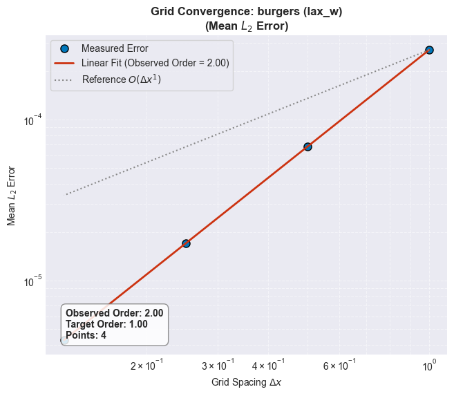 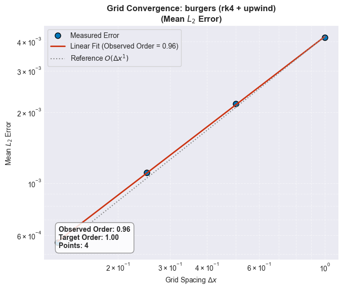 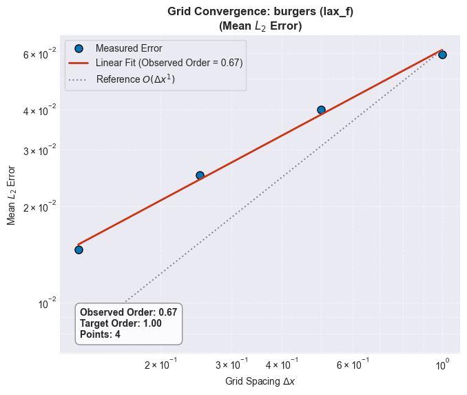

### Conclusions (Smooth)

> By removing the shock discontinuity, the observed convergence rates closely match the theoretical truncation orders of the numerical schemes.

1. **Lax-Wendroff Recovers 2nd-Order**: As a true 2nd-order scheme in space and time, Lax-Wendroff perfectly attains $O(\Delta x^{2.00})$ convergence when the profile is smooth.
2. **Upwind Becomes the Bottleneck**: Although RK4 is 4th-order in time, the `upwind` spatial operator is only 1st-order. As expected, this bottlenecks the entire scheme to exactly $O(\Delta x^{0.96}) \approx 1st$-order.
3. **Lax-Friedrichs Remains Diffusive**: While it improves over the shock scenario, the heavy geometric diffusion inherent to Lax-Friedrichs caps it at a smeared fractional rate ($O(\Delta x^{0.67})$).
