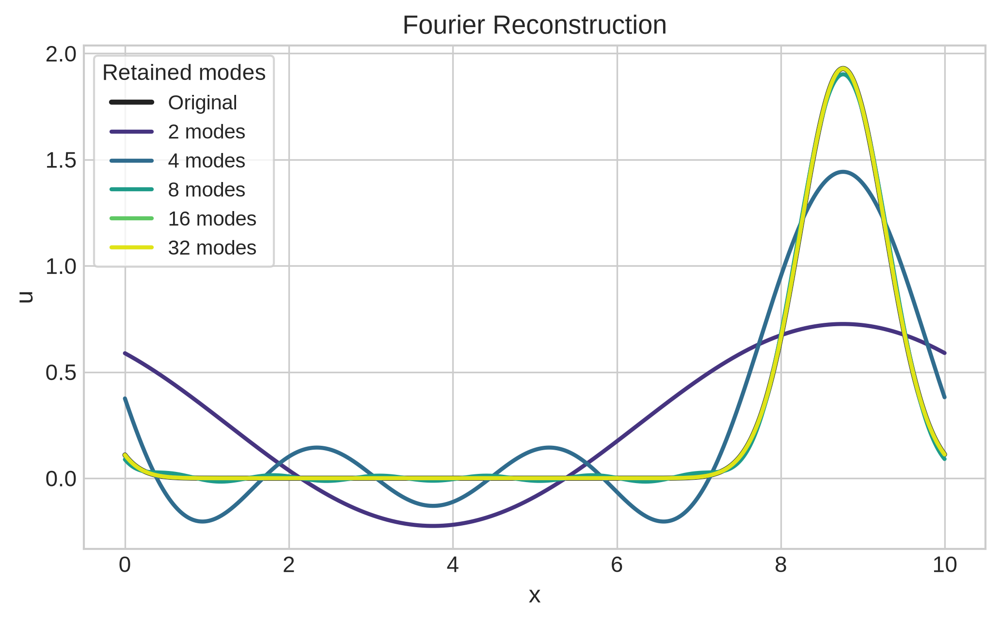
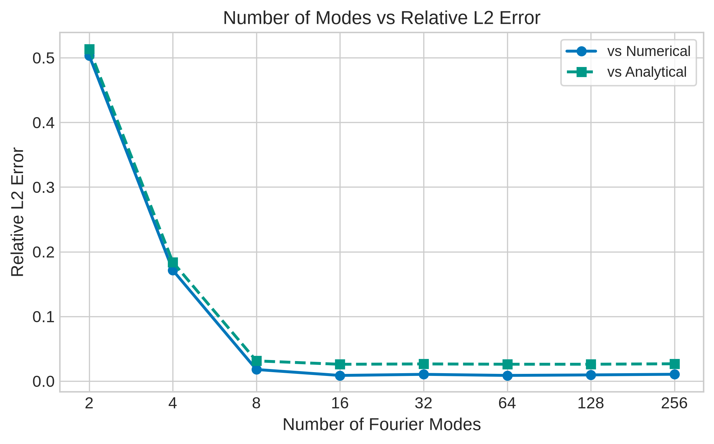
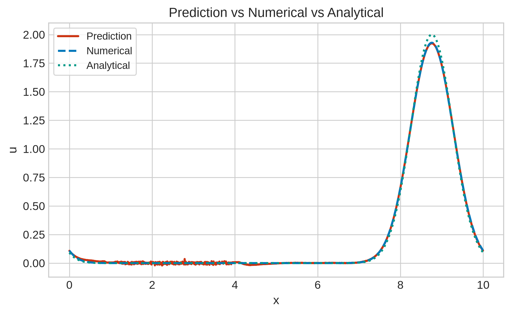
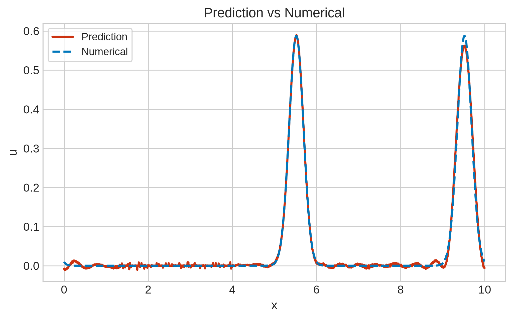
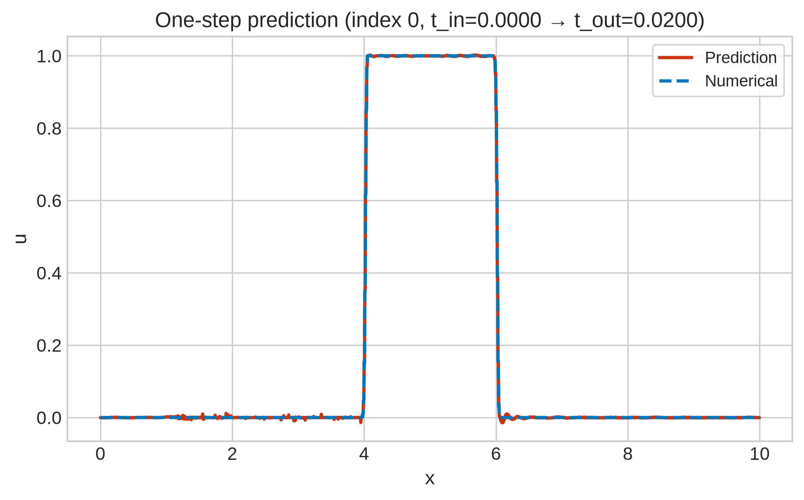
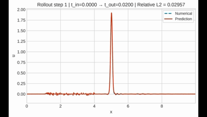
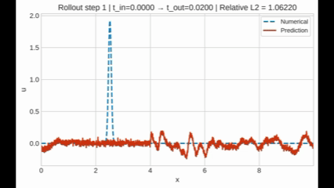
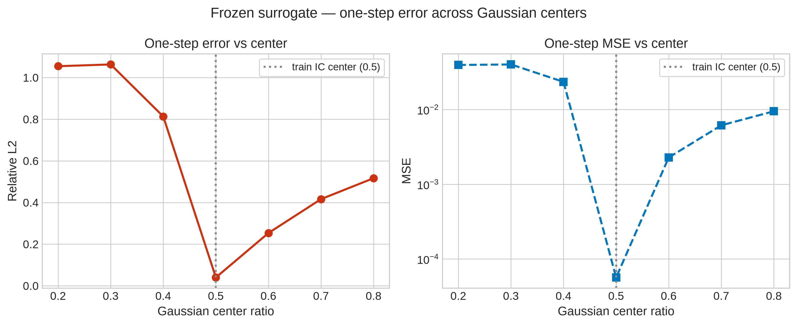

# Evolution of the Spectral Surrogate

Building upon the [convolutional surrogate](CNN_surrogate.md) developed in the previous document, this investigation explores whether transport dynamics can instead be learned directly in the frequency domain.

Rather than operating on local spatial neighborhoods, the surrogate predicts PDE evolution by transforming the field into Fourier space, evolving its spectral coefficients, and reconstructing the physical solution.

This serves as the first step toward implementing Fourier Neural Operators within Tempest.

## Key Findings
- Fourier representations naturally compress smooth PDE solutions into a small number of dominant modes.
- A lightweight spectral surrogate accurately learned one-step transport dynamics.
- The surrogate generalized to unseen waveform combinations such as double Gaussian and square-wave profiles.
- Generalization deteriorated for translated initial conditions, revealing a lack of translation equivariance.
- This limitation motivates moving toward Fourier Neural Operators.

## Motivation

The previous convolutional surrogate demonstrated that local kernels could learn an approximate transport operator. Since convolution operates on local neighborhoods, information propagates across the domain only through repeated applications of the convolution operator. 

Spectral methods instead provide every layer with a global view of the solution by representing it directly in Fourier space. Learning then occurs directly on these frequency components before reconstructing the physical field.

## Fourier Representation

Before constructing the surrogate, the numerical solution was transformed into Fourier space.

For smooth solutions such as Gaussian wave packets, the Fourier spectrum decayed rapidly, with almost all energy concentrated within the first few modes. This immediately suggested that the evolution operator might only require a small number of Fourier coefficients.

The reconstruction experiment demonstrated that only a handful of Fourier modes were sufficient to recover the original solution with high accuracy.


 <br><br>

For Gaussian initial conditions, approximately sixteen modes reconstructed the field almost perfectly.

## Initial Spectral Surrogate

A minimal spectral surrogate was then constructed.

```
     Input field
         ↓
        FFT
         ↓
 Retain first N modes
         ↓
Learn spectral evolution
         ↓
    Inverse FFT
         ↓
Predicted next timestep
```

Unlike the previous CNN, no spatial convolutions were used. The network operated entirely in Fourier space.

The surrogate successfully predicted the next timestep with high accuracy when evaluated on Gaussian transport.

 <br>

## Generalization

The surrogate was trained on Gaussian and square-wave initial conditions and evaluated on unseen waveform combinations, including double Gaussian and square-wave profiles. In both cases, one-step predictions remained accurate despite these exact configurations never appearing during training.

<br>

This suggests that the network learned meaningful transport dynamics rather than memorizing individual trajectories.

## Multi-Step Rollout

The surrogate was evaluated on long autoregressive rollouts by repeatedly feeding its own predictions back as input. This tests whether the learned operator remains stable when numerical errors accumulate over time.

The surrogate performed exceptionally well when the Gaussian was centred at its training location, prediction accuracy deteriorated rapidly when evaluated on translated Gaussian profiles.

<br>

To quantify this behaviour, the trained model was frozen and evaluated on identical Gaussian profiles with varying centre locations.



The minimum error occurred exactly at the training position (center_ratio = 0.5), while translations away from this point produced a sharp increase in prediction error.

This behaviour is unexpected because the linear advection equation is translation equivariant; shifting the initial condition should not change the underlying evolution operator.

Instead, the results indicate that the surrogate learned a position-dependent spectral mapping rather than a translation-equivariant transport operator.

## Interpretation

In Fourier space, translating a signal does not alter its magnitude spectrum. Instead, each Fourier coefficient receives a phase shift,

$$\hat{u}(k)\rightarrow \hat{u}(k)e^{-ikx_0}.$$

Since the advection operator is translation equivariant, its action should commute with this phase shift. The observed behaviour indicates that the learned operator does not preserve this symmetry.

Consequently, the surrogate generalized well to new waveforms while struggling with the same waveform shifted to unseen spatial locations.

## Conclusion

The lightweight spectral surrogate demonstrates several desirable properties:

- Stable autoregressive rollouts for in-distribution initial conditions.
- Generalization to unseen waveform shapes.
- Accurate one-step prediction on in-distribution data.
- Compact and computationally efficient architecture.

However, the translation experiment exposed a key limitation: the model does not satisfy translation equivariance, a fundamental symmetry of the advection equation.

This limitation is not caused by rollout instability or implementation errors, but by the learned spectral operator itself.

## Future Work

The next stage of Tempest will focus on learning operators that explicitly preserve translation symmetry.

Planned directions include:

- Learning spectral operators that explicitly preserve translation equivariance.
- Operating directly on complex Fourier coefficients rather than separating magnitude and phase.
- Comparing the learned operator against the exact Fourier evolution operator for linear advection.
- Extending the architecture toward Fourier Neural Operators for more complex PDEs.

This study therefore serves as a bridge between the initial CNN surrogate and full neural operator methods, providing a clear motivation for moving from local spatial learning to global operator learning.

---


