# Initial exploration of a stable and working surrogate model
    This document explores an attempt to develop a surrogate model for the linear advection equation.
---

## One-step prediction
- Started with a standard, dense linear neural network with no physics constraints trained on mean squared error (MSE) to predict just T ---> T+1.
- It worked decently for a single step.  

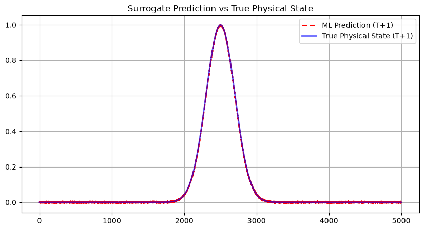  

- The model must have learned local correlations without learning long-term dynamics. It probably had no understanding of the physics, space, or waves.

## Multiple-step prediction
- Fed the model's prediction into itself in an autoregressive loop to simulate continuous time (T ---> T+100).
- Numerical dispersion was observed in the form of phase lag.  

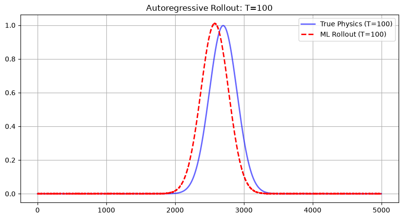  

- The model must have figured out how to move the wave, but struggled with speed and energy conservation.

## Total/mean mass conservation
- The first physical constraint intertwined with the loss function.
- The wave still degraded and lost its shape.  

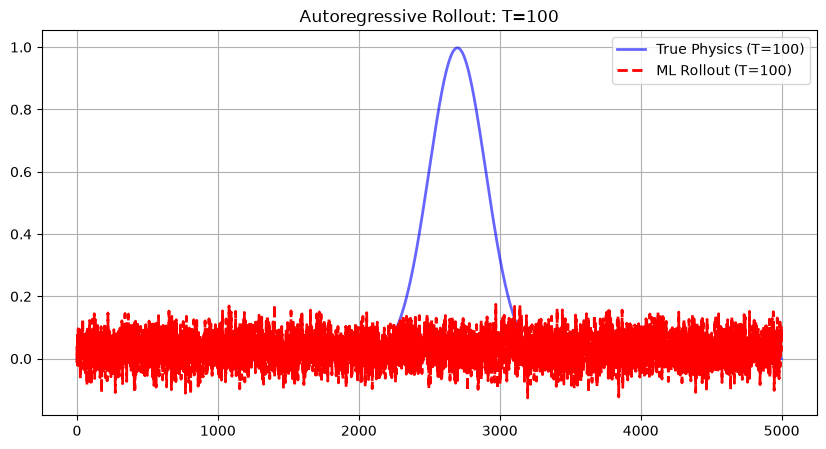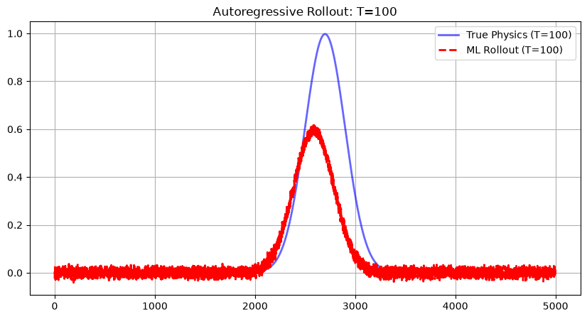  

- Mass conservation was definitely too loose of a constraint. A peak and a flat puddle can have the same mass. The model just smeared out the wave to follow the constraint.

## L2 energy conservation and autoregressive unrolling
- Upgraded the constraint to punish changes in the MSE energy. Also implemented autoregressive unrolling, in which the model uses predicted step T+1 to train step T + 2 and so on.
- This worked perfectly for short time periods but on a large enough timeline, phase lag was observed. Dissapation was solved but dispersion was introduced.  

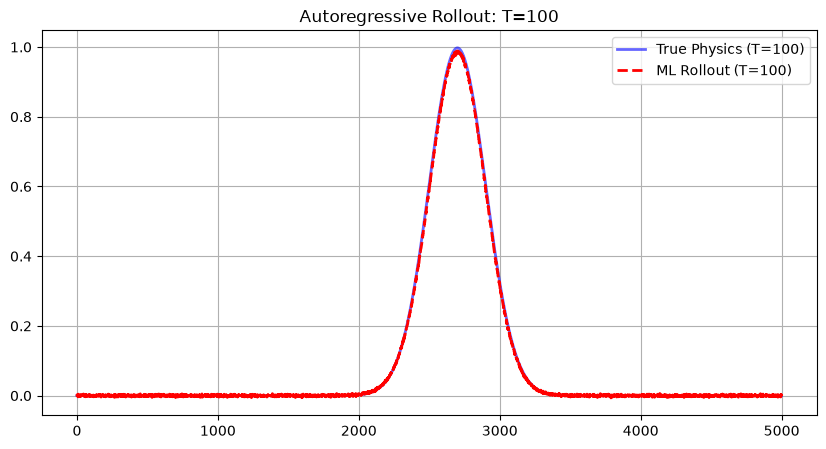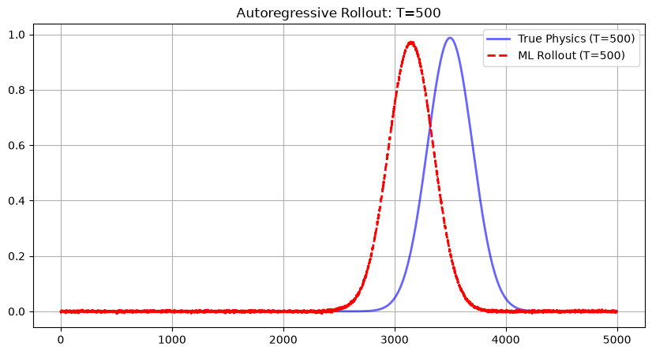  

- A linear neural network is inherently blind to geometry. It has no concept of a "grid" and processes each point of the grid independently. It probably memorized the location of the wave, not its behaviour.

## CNN introduction
- Replaced the dense network with a convolutional neural network with periodic padding.
- Even though energy and mass was conserved, the shape broke down and "terracing" was observed.  

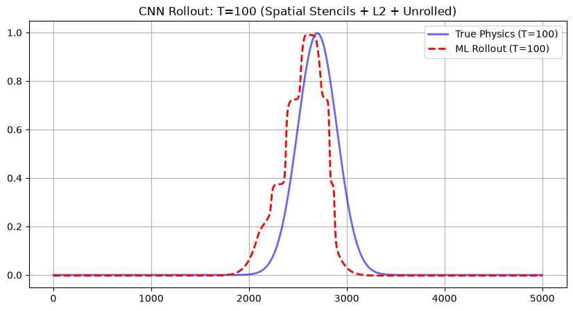  

- The activation function "ReLU" was the most probable culprit. It is a piecewise linear function that poorly represents smooth oscillatory dynamics.

## Activation function and generalization
- Replaced the linear ReLU with the GeLU (Gaussian Error Linear Unit). 
- Introduced data for a square wave along with gaussian, and implemented random batch sampling.
- Faced with a floating baseline and diffused shape.  

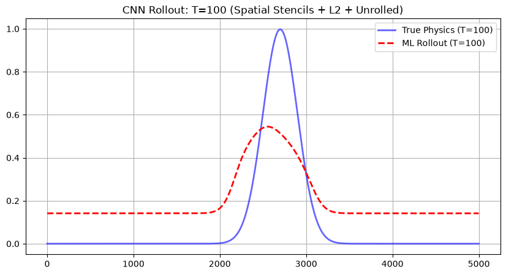  

- The model "cheated" the energy conservation law by adding a "pedestal" which mathematically satisfies the constraint, but is physically nonsensical. Also noticed that the physical loss was being minimized very slowly.

## Priority to physics loss
- Increased the contribution of the physics loss.
- Gradients exploded quickly, even after implementing gradient clipping.

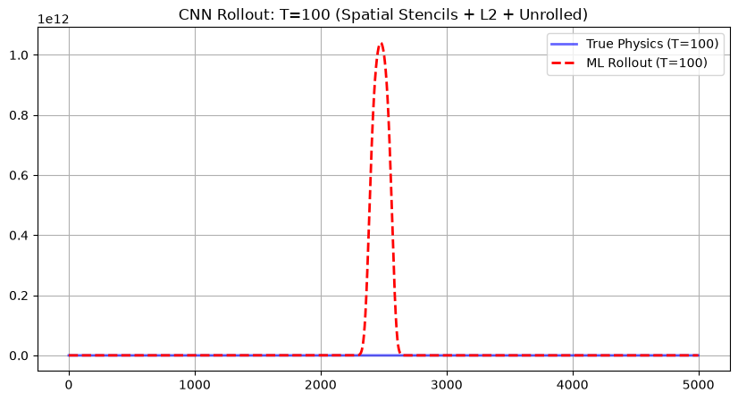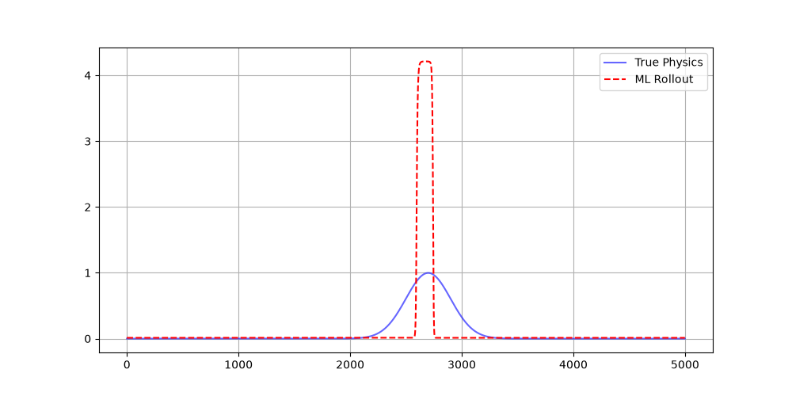  

- The model works around the constraints by pumping energy into the wave instead of respecting its shape and movement.

## Major optimizations
- Set physics loss contribution to zero for the first 200 epochs to make sure the model learns the basic shape and movement of the wave first. 
- Removed GeLU that might have been driving amplification behaviour, because advection is linear process.
- Implemented dynamic energy conservation. Step T+2 is optimized based on the energy of predicted step T+1, not the original energy.
- Over long periods of time (T = 500s), stability and shape was excellently preserved. However, phase lag or dispersion was still observed. The model learned a slightly slower wave speed.

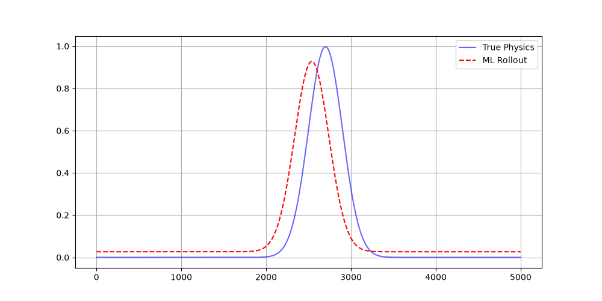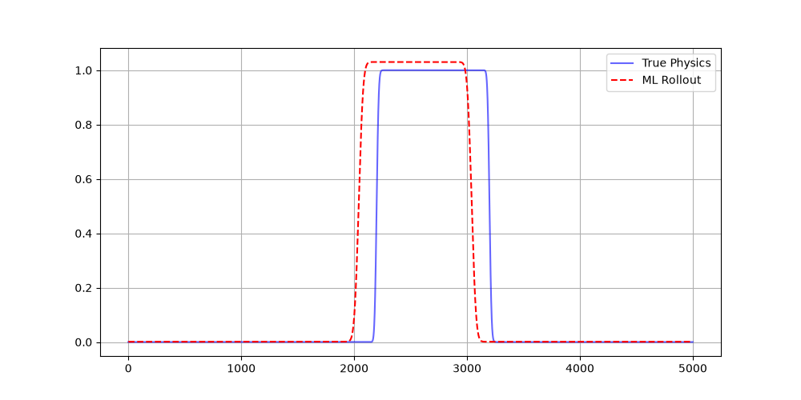  

## Final notes

Through the use of master_dataset.npz and randomized batch sampling, the model moved beyond simple curve-fitting. It learned the universal advection operator, successfully generalizing it over both Gaussian and square waveforms.

Dynamic energy conservation ensures that the model is aware of the energy in each of its predicted steps, preventing explosions or dampening.

Furthermore, by stripping off the GeLU activator, the model was prevented from "cheating" the energy constraints through artifical amplitude amplification.

It is demonstrated that the surrogate reproduces numerical artifacts similar to classical solvers. This means that the model itself behaves like a numerical scheme.

## Conclusion

This study roots from the very basics of ML. It assumes a simple linear neural network and through continuous optimization, produces an accurate and stable physics-informed model that is significantly faster than a finite-difference numerical solver.

## Technical summary

| Feature           | Implementation                                            |
| ----------------  | --------------------------------------------------------- |
| Architecture      | 1D Linear Convolutional Neural Network (Circular Padding) |
| Loss Function     | MSE + Dynamic Energy Conservation (Step T→T+1)            |
| Training Strategy | Data-only → Physics-informed                              |                  
| Performance       | Significant speedup over 4th-order Finite Difference solvers|

## Future Work

- This study approaches the limit of purely local CNN modelling.
- To reduce phase lag, the model naturally leads to:
    * Fourier methods
    * Neural operators
    * Frequency-domain learning
- Before this, the following investigation is planned:
    * Velocity as an explicit parameter
    * Multi-resolution training
    * Comparison against numerical schemes