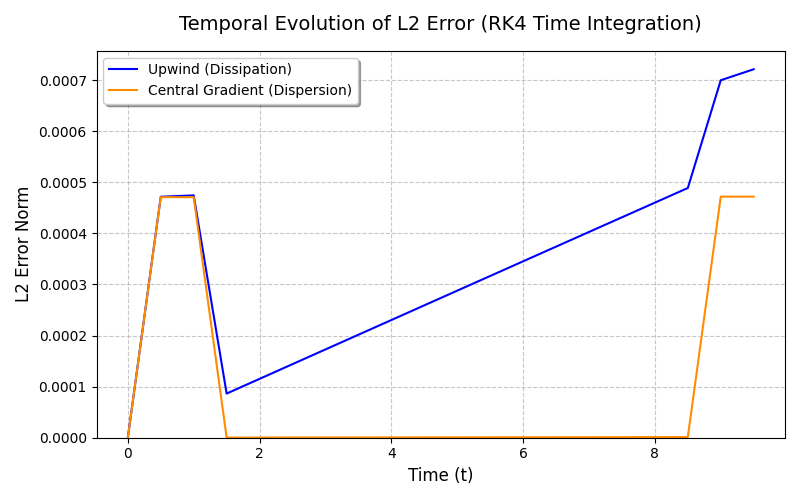
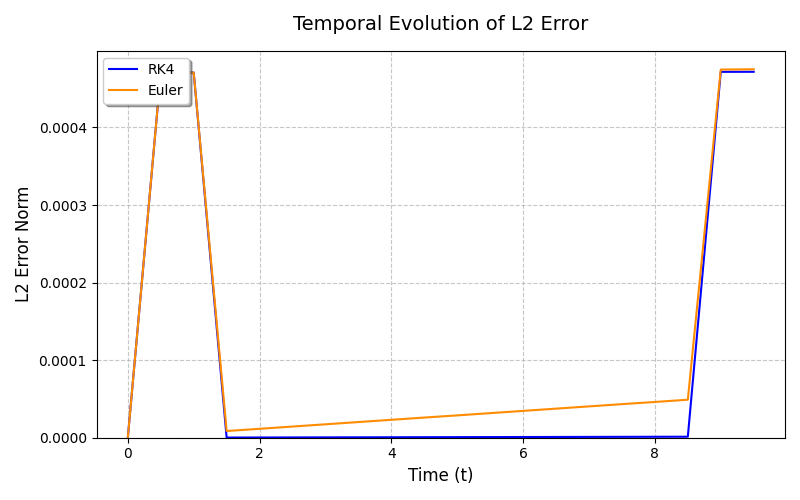
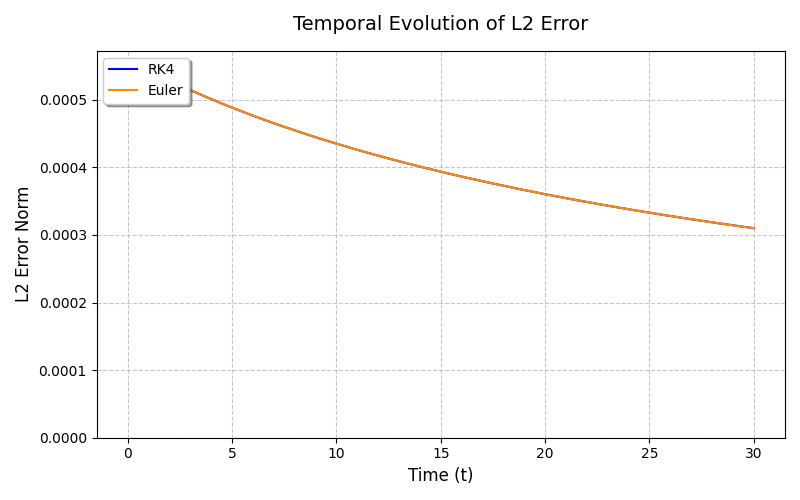
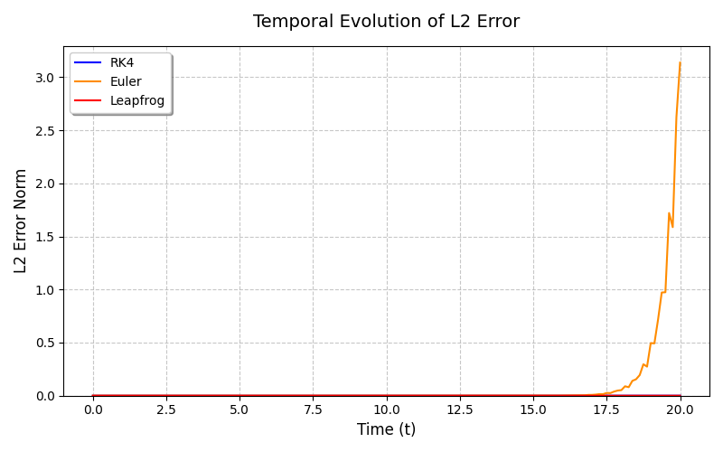

# Validation and Convergence Study for Tempest

## Overview

This document summarizes the initial validation and convergence studies conducted using **Tempest**, a modular framework for simulating and analyzing partial differential equations (PDEs) using finite-difference methods.

Three canonical PDE systems were investigated:
- Linear Advection
- Diffusion
- Wave Propagation

The objective of these studies was to:
- validate numerical implementations against analytical solutions
- characterize numerical artifacts
- verify asymptotic convergence behavior
- evaluate the interaction between spatial and temporal discretization schemes

All experiments were generated through an automated testing and validation pipeline.

---

# Methodology Overview

The framework evaluates numerical schemes along two complementary dimensions:

## 1. Validation (Physical & Temporal Fidelity)

For validation studies:
- a fixed numerical configuration is evolved over time
- exact analytical solution
- the evolution of the global error norm is tracked

Analytical comparisons were performed using boundary-consistent exact solutions, including periodic wrapping and reflective mappings where applicable.

The primary metric used throughout these studies was the global L2 error norm.

---

## 2. Convergence (Asymptotic Accuracy)

To verify mathematical correctness, the spatial grid spacing $\Delta x$ and timestep $\Delta t$ are systematically refined while maintaining:
- fixed physical domain size
- fixed final physical time
- consistent stability scaling

The empirical convergence order 'p' is extracted via linear regression of:

```text
log(Error) vs log(Δx)
```

This verifies whether the numerical implementation reproduces the theoretical truncation-error scaling of the discretization schemes.

---

# 1. Linear Advection Equation

## Objective

Evaluate:
- Upwind vs Central Difference spatial discretizations
- Explicit Euler vs RK4 temporal integration

for the linear advection equation:

```text
∂u/∂t + c ∂u/∂x = 0
```

---

# 1.1 Spatial Artifacts: Dissipation vs Dispersion



Although both schemes solve the same governing equation, they exhibit fundamentally different long-term numerical behavior due to their truncation-error structure.

---

## Upwind Scheme: Numerical Dissipation

The Upwind scheme demonstrates steadily increasing error over time.

Its dominant truncation error introduces a second spatial derivative term proportional to:

```text
u_xx
```

which behaves similarly to diffusion.

As a result, wave amplitudes gradually decay and the numerical solution experiences artificial viscosity.

This phenomenon is known as **numerical dissipation**.

---

## Central Difference Scheme: Numerical Dispersion

The Central Difference scheme preserves wave amplitude significantly more effectively.

Because its symmetric stencil cancels the leading second-derivative truncation term, the dominant error instead behaves like a third spatial derivative proportional to:

```text
u_xxx
```

Rather than dissipating energy, this produces phase-velocity mismatch and oscillatory trailing structures.

This behavior is known as **numerical dispersion**.

---

## Interpretation

The comparison illustrates a classical numerical tradeoff:

| Scheme | Dominant Artifact |
|---|---|
| Upwind | Dissipation |
| Central Difference | Dispersion |

The Upwind scheme prioritizes stability and monotonicity at the cost of amplitude loss, while the Central Difference scheme improves amplitude preservation but introduces phase oscillations.

---

# 1.2 Temporal Integration: Euler vs RK4



To isolate temporal integration effects, the spatial discretization was fixed to the first-order Upwind scheme.

The simulation was then evolved using:
- Explicit Euler
- RK4

under identical CFL conditions.

---

## Observations

Both methods produced nearly identical global error evolution.

Although RK4 slightly suppressed intermediate temporal error accumulation, the overall solution accuracy remained dominated by the spatial discretization error introduced by the Upwind stencil.

---

## Interpretation

This demonstrates the concept of **error dominance**.

The global error may be expressed schematically as:

```text
ε = O(Δx) + O(Δt^p)
```

When the spatial discretization itself is strongly dissipative, improvements in temporal accuracy contribute comparatively little to the final solution quality.

In this regime the computational cost of RK4, which requires four intermediate evaluations per timestep, provides limited practical advantage over Explicit Euler.

---

# 1.3 Convergence Results

| Scheme | Theoretical Order | Empirical Order |
|---|---|---|
| Upwind | First-order | 1.00 |
| Central Difference | Second-order | 2.00 |

The measured convergence slopes match the theoretical truncation-error scaling of the corresponding spatial discretizations.

---

# 2. Diffusion Equation

## Objective

Evaluate Explicit Euler and RK4 under the parabolic diffusion equation:

```text
∂u/∂t = D ∂²u/∂x²
```

using a second-order central Laplacian operator.

---



# 2.1 Parabolic Stability Constraints


## Observations

The diffusion equation imposed significantly stricter timestep requirements than the advection equation.

Stable evolution required:

```text
Δt ∝ Δx²
```

to satisfy the explicit parabolic stability condition.

Once stabilized, the error evolution of Explicit Euler and RK4 became nearly indistinguishable.

---

## Interpretation

For explicit diffusion solvers, stability is governed by:

```text
r = DΔt / Δx² ≤ 1/2
```

As spatial resolution increases the timestep must shrink quadratically, dramatically suppressing temporal truncation error.

Under these conditions, the dominant error becomes the second-order spatial discretization itself.

Consequently, higher-order temporal integration provides minimal measurable benefit.

---

# 2.2 Convergence Results

| Scheme | Theoretical Order | Empirical Order |
|---|---|---|
| Explicit Euler | Second-order | 1.94 |
| RK4 | Second-order | 1.94 |

Both schemes recover the expected second-order spatial convergence behavior.

---

# 3. Wave Equation

## Objective

Evaluate:
- Explicit Euler
- RK4
- Leapfrog

for long-term wave propagation and energy conservation.

The governing equation is:

```text
∂²u/∂t² = c² ∂²u/∂x²
```

---



# 3.1 Energy Conservation & Symplectic Integration

---

## Observations

Explicit Euler exhibited rapidly growing instability over long simulation times.

Both RK4 and Leapfrog maintained stable bounded error profiles throughout the simulated domain.

---

## Interpretation

The wave equation represents a conservative dynamical system.

### Explicit Euler

Explicit Euler continuously injects numerical energy into oscillatory systems, eventually causing exponential instability growth.

---

### RK4

RK4 significantly suppresses truncation error through higher-order temporal accuracy.

However, it is not inherently energy-conserving and may gradually dissipate energy over sufficiently long integrations.

---

### Leapfrog

Leapfrog is a symplectic integrator.

Rather than minimizing instantaneous truncation error alone, symplectic methods preserve the long-term geometric structure of conservative systems.

As a result energy error remains bounded and long-term oscillatory stability is maintained.

---

# 3.2 Convergence Results

| Scheme | Theoretical Order | Empirical Order |
|---|---|---|
| RK4 | Second-order spatially limited | 2.00 |
| Leapfrog | Second-order | 2.00 |

The convergence behavior confirms that the observed global accuracy is primarily limited by the second-order spatial discretization.

---

# 4. Framework Verification & Conclusions

These studies validate both the numerical correctness and physical consistency of the Tempest framework.

The automated testing pipeline successfully reproduced:
- expected convergence orders
- known numerical artifacts
- stability constraints

However, long-term wave propagation studies remained sensitive to accumulated phase error and boundary interactions, particularly under highly dispersive configurations.

---

# Key Findings

1. Numerical behavior depends strongly on the interaction between spatial and temporal discretizations.

2. Upwind schemes introduce numerical dissipation, while symmetric central schemes introduce numerical dispersion.

3. Higher-order temporal integration does not necessarily improve global accuracy when spatial truncation error dominates.

4. Symplectic integrators provide superior long-term stability for conservative oscillatory systems.

5. The observed empirical convergence rates closely match theoretical truncation-error predictions.

---

# Future Work

Planned extensions include:
- generalized multi-field systems
- implicit solvers for parabolic PDEs
- higher-order conservative schemes
- nonlinear PDE systems
- 2D structured grids
- scientific Machine Learning applications

The long-term objective is to leverage the validated numerical infrastructure as a controlled data-generation environment for:
- Physics-Informed Neural Networks (PINNs).
- Neural Operators.
- Hybrid numerical–learned solvers.
