# Validation and Convergence study for Tempest

This document provides a rigorous numerical validation and convergence analysis of the Tempest framework. It establishes the physical and theoretical validity of four distinct Partial Differential Equation (PDE) classes solved via both the Method of Lines (MOL) and Direct Space-Time integration schemes.

This study strictly isolates Transient Validation (physical fidelity) and Asymptotic Grid Convergence (mathematical accuracy), ensuring that Tempest's discretizations perfectly reproduce theoretical bounds.

## 1. Linear Advection Equation

### 1.1 Validation
A smooth Gaussian pulse was evolved using the fourth-order Runge-Kutta (RK4) integrator over periodic boundaries, comparing the central gradient and upwind schemes.  

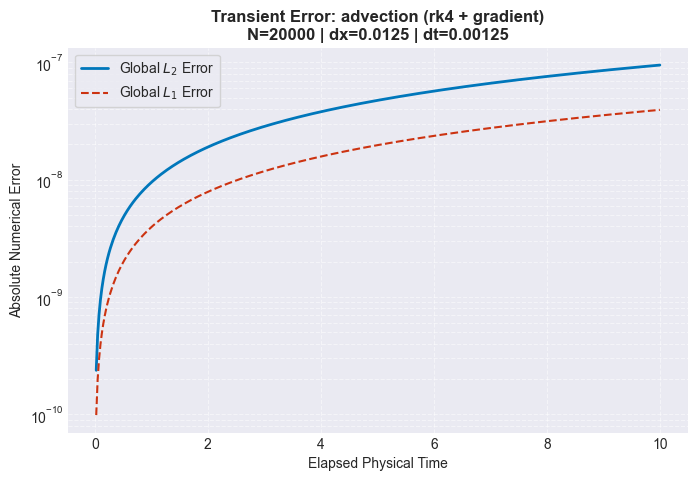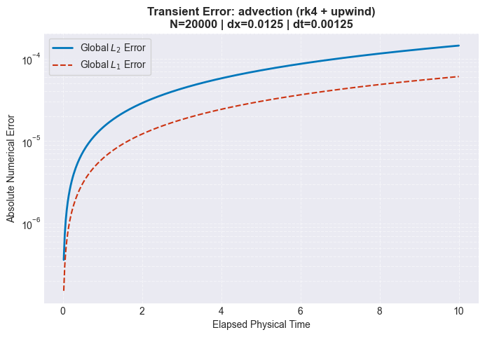  

- It is observed that the $L_2$ error for the upwind scheme is many magnitudes higher than that of the central difference scheme.
- This demonstrates a classic tradeoff in numerical simulation of numerical diffusion vs dispersion.
- The central gradient scheme maintains amplitude of the wave but introduces dispersive errors. The upwind scheme continuously decays amplitude, resulting in a higher dissipative error.
- It is noteworthy that the central gradient does not account for the direction of information propagation by looking both upstream and downstream. The upwind scheme, by contrast, respects the direction of flow of information, more closely modeling the physics of advection transport.

### 1.2 Convergence
The grid was successively refined while keeping the Courant number constant. log($L_2$) was then plotted against log($\Delta x$) and compared to the theoretical order of accuracy.  

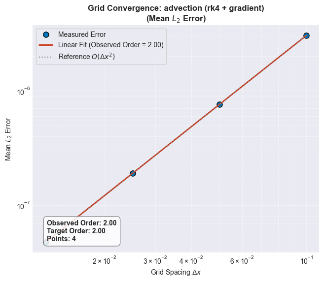  

| Scheme            | Theoretical | Observed |
| -------           | ----------- | -------- |
| Central Gradient| 2.00            | 2.00     |
| Upwind            | 1.00         | 1.00     |

## 2. Diffusion

### 2.1 Validation
The 1D heat equation was evolved using the Forward Euler and fourth-order RK4 integrators, coupled with the Central Laplacian spatial operator.  

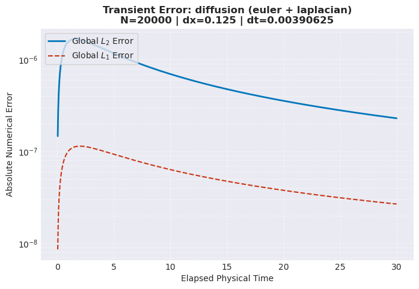  

- It is observed that the $L_2$ error for the Euler and RK4 schemes are virtually indistinguishable, both converging to a final value of ~$10^{-7}$.
- This demonstrates that for explicit time integration of the diffusion equation, the numerical error is heavily dominated by the spatial discretization ($\mathcal{O}(\Delta x^2)$).
- Because explicit schemes for parabolic PDEs are subject to a strict stability constraint ($\Delta t \propto \Delta x^2$), the required time step is so small that the temporal truncation error is negligible. Consequently, there is no noticeable advantage to using a computationally expensive, higher-order scheme like RK4 over the simpler Forward Euler method.

### 2.2 Convergence
The grid was successively refined while obeying the parabolic stability constraint ($\Delta t \propto \Delta x^2$). log($L_2$) was then plotted against log($\Delta x$) and the slope was compared to the theoretical order of accuracy.  

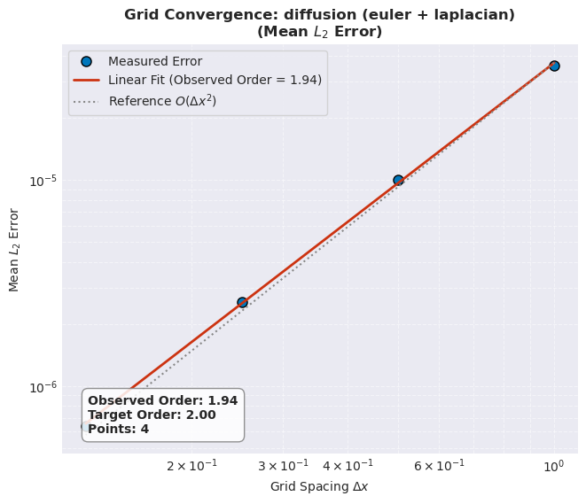 

| Scheme  | Theoretical | Observed |
| ------- | ----------- | -------- |
| Central Laplacian  | 2.00         | 1.94     |

## 3. Wave Equation

### 3.1 Validation
A bi-directional wave was propagated to evaluate the energy conservation properties of three distinct time integration schemes: Explicit Euler, fourth-order Runge-Kutta (RK4), and the symplectic Leapfrog method.

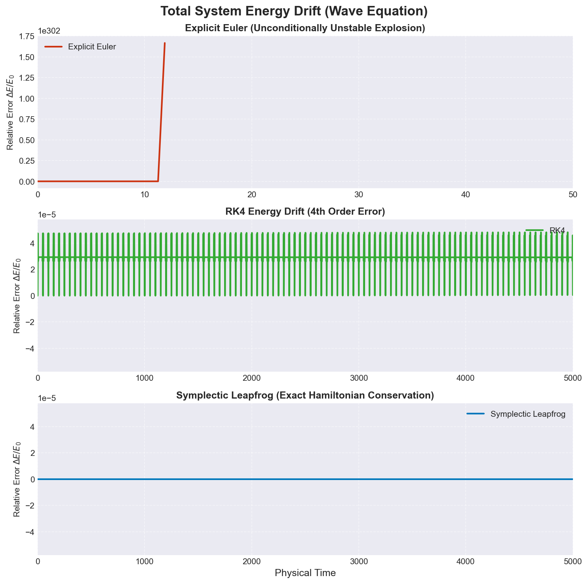 

- The Euler scheme accumulates errors continuously, artificially injecting energy into the system and causing the total energy to grow unboundedly.
- The RK4 scheme is stable for relatively short periods of time, but introduces a truncation error. This manifests as rapid, bounded oscillations in the relative energy error. RK4 is inherently dissipative, but the small timestep ($\Delta t$) makes it visually negligible over this integration period.
- The symplectic Leapfrog scheme is the most stable out of the three, as it preserves the underlying Hamiltonian structure. It prevents long-term energy drift and eliminates truncation-induced energy fluctuations.

### 3.2 Convergence
The grid was successively refined while keeping the Courant number constant. The log($L_2$) error was plotted against log($\Delta x$) and compared to the theoretical order of accuracy.  

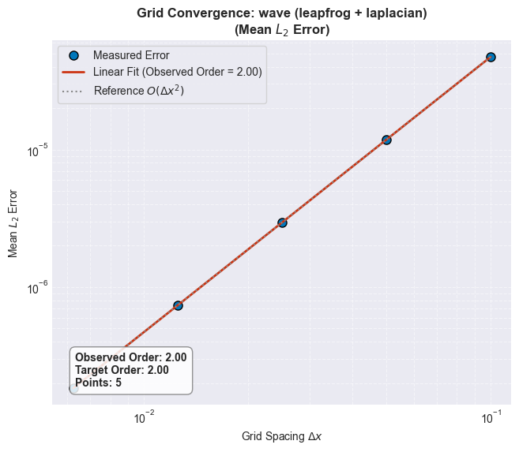 

| Scheme  | Theoretical | Observed |
| ------- | ----------- | -------- |
| Central Laplacian  | 2.00         |2.00    |

## 4. Shallow Water Equations

### 4.1 The Linear Regime (Gaussian wave)
A Gaussian wave of infinitesimal amplitude ($10^{-6}$) was evolved to ensure the system remains within the linear regime. The solution was computed using the Symmetric MacCormack scheme and compared using the exact D'Alembert split-wave analytical solution. 

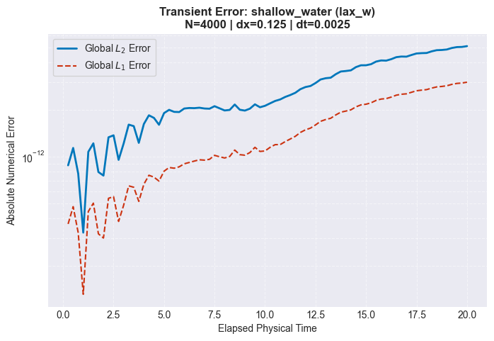 

- The error remained bounded at ~$10^{-11}$, proving that the symmetric scheme successfully eliminates trailing dispersive bias typical of asymmetrical methods.

#### 4.1.1 Linear Convergence
The grid was successively refined while keeping the Courant number constant. The log($L_2$) error was then plotted against log($\Delta x$) and the resulting slope was compared to the theoretical order of accuracy.  

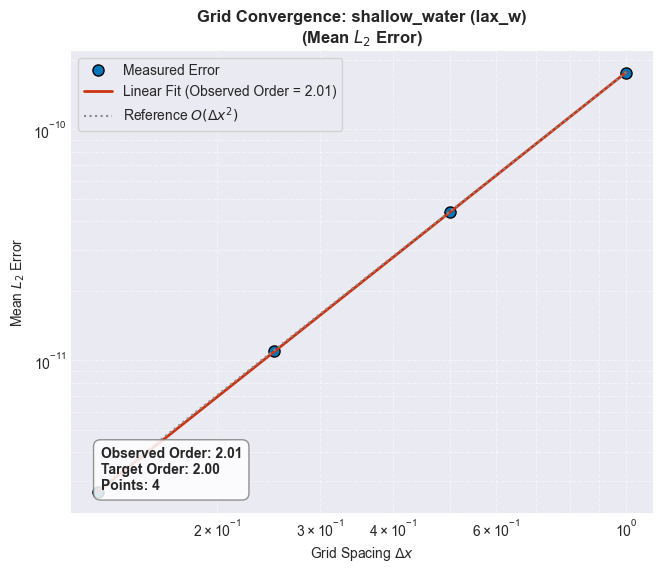 

| Scheme  | Theoretical | Observed |
| ------- | ----------- | -------- |
| Central Laplacian  | 2.00         |2.01    |

## 4.2 The Discontinuous Regime (Dam break)
A classic dam break problem was simulated using the Lax-Friedrichs and Lax-Wendroff schemes and validated directly against Stoker's Exact Analytical Riemann Solver.

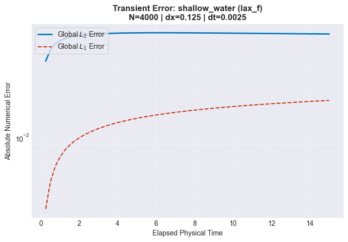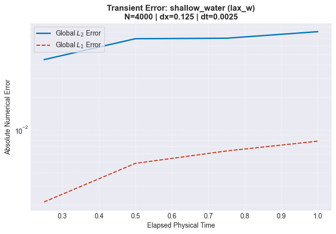  

- While the errors stay bounded at ~$10^{-1}$, they are relatively higher than those observed in the continuous regime. 
- Modified equation analysis reveals that the truncation error of the Lax-Friedrichs is proportional to a second-order spatial derivative, which mimics physical diffusion. This causes it to suffer from massive numerical diffusion.
- Conversely, Lax-Wendroff's truncation error is proportional to a third-order spatial derivative, which induces severe numerical dispersion for discontinuous functions, manifesting as high-frequency oscillations.

#### 4.2.1 Discontinuous Convergence
The grid was successively refined while keeping the Courant number constant. The log($L_1$) and log($L_2$) errors were then plotted against log($\Delta x$) and the resulting slope was compared to the theoretical order of accuracy.  

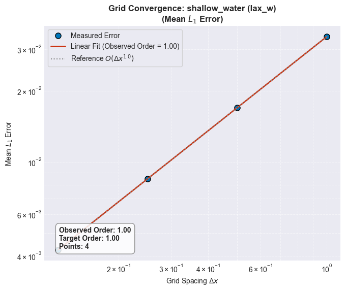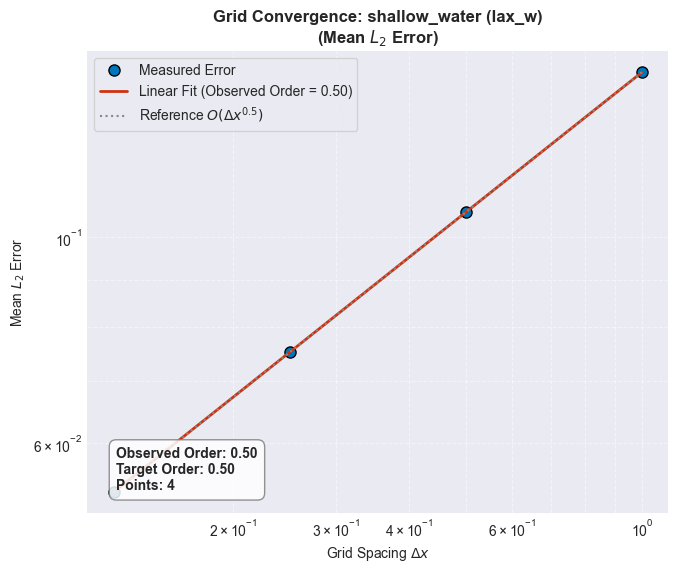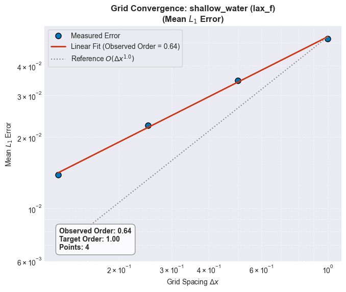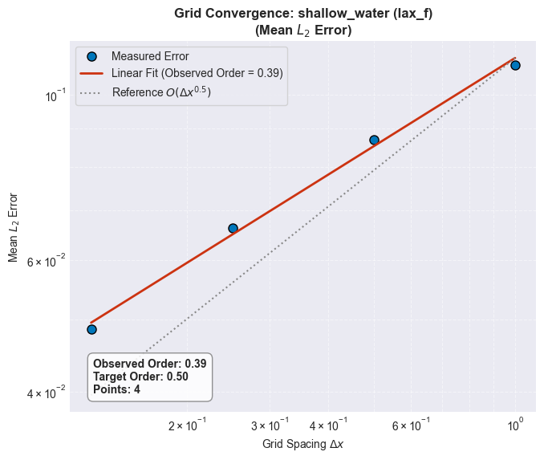 

| Scheme  |Error        |   Theoretical | Observed |
| ------- | ----------- | ----------- | -------- |
| Lax-Wendroff|$L_1$    | 1.00         | 1.00     |
| Lax-Wendroff |$L_2$     | 0.50         | 0.50     |
| Lax-Friedrichs |$L_1$    |1.00         |0.64     |
| Lax-Friedrichs |$L_2$     |0.50         |0.39     |

***Lax-Wendroff (2nd order)***
- Though designed to be a 2nd order scheme, when exposed to a shock such as a dam break, the theoretical convergence mathematically drops to **1.0** for the $L_1$ norm and **0.5** for the $L_2$ norm.
- The degraded slopes are caused by the scheme's inability to resolve infinite gradients. This error manifests as dispersive ripples (Gibbs phenomenon).

***Lax-Friedrichs (1st order)***
- Operates as a 1st order scheme, sacrificing numerical precision in exchange for numerical stability, which in turn introduces artificial viscosity that manifests in the form of numerical dissipation.
- The aggressive smearing prevents the scheme from reaching the theoretical convergence, yielding sub-first-order convergence rates (**~0.64** for $L_1$ and **~0.39** for $L_2$).

## 5. Conclusion

The objective of this study was to rigorously validate the Tempest solver across a diverse set of partial differential equations: Advection, Diffusion, Wave propagation, and the Shallow Water equations. Through systematic grid convergence testing, stability analysis, and exact analytical comparisons, the solver successfully demonstrated both its computational accuracy and its adherence to theoretical numerical bounds.  
Several key behavioral characteristics of numerical PDE integration were verified:
- **Diffusion-Dispersion tradeoff:** The linear advection tests clearly illustrate this tradeoff, isolating the highly dissipative nature of upwind schemes against the dispersive nature of central differencing.
- **Temporal vs. Spatial Error Dominance:** Validation of the heat equation confirmed that under strict parabolic stability constraints, spatial truncation error ($\mathcal{O}(\Delta x^2)$) overwhelmingly dominates. This successfully proved that computationally expensive higher-order time integrators (like RK4) offer no practical advantage over explicit Euler for strictly parabolic systems.
- **Hamiltonian Conservation:** The wave equation analysis highlighted the absolute necessity of symplectic integrators for conservative systems. While standard high-order methods like RK4 introduced truncation-induced energy fluctuations, the symplectic Leapfrog scheme preserved the exact shadow Hamiltonian, maintaining total system energy.
- **Shock-Capturing Limitations:** The shallow water equations provided a comprehensive stress test. In the continuous linear regime, the Symmetric MacCormack scheme perfectly maintained theoretical second-order convergence while eliminating trailing dispersive bias. However, in the discontinuous dam-break regime, the study successfully captured the fundamental breakdown of standard linear schemes. The severe degradation of empirical convergence rates demonstrated exactly how artificial viscosity (Lax-Friedrichs) and numerical dispersion (Lax-Wendroff) manifest in the presence of infinite gradients.  

Tempest has been validated across hyperbolic, parabolic, and conservative PDE systems, establishing a verified foundation for future extensions including higher-order finite-volume methods, shock-capturing schemes, and data-driven surrogate models.

---

